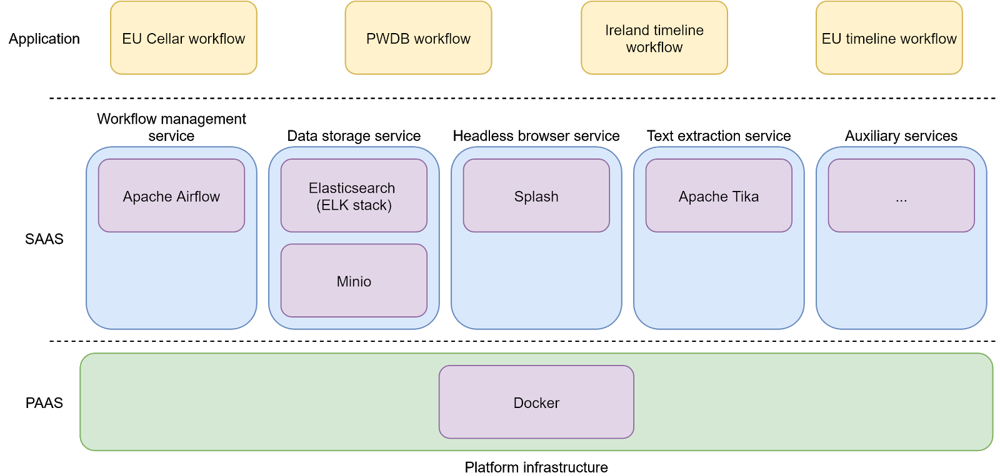

# Sem-covid infrastructure stack

A docker-compose suite of service configurations representing the Meaningfy
infrastructure stack for Machine Learning and Data Driven applications.


## Services and their configuration

It contains the following tech services:
- Elasticsearch, Logstash & Kibana (ELK) service stack.
- Jupiter Notebook & a SFTP service with a common `/work` space.
- Min.io object storage service
- MLFlow experiment management service
- AirFlow workflow management system (currently deployed with Celery & Redis services)


## Architectural overview

Here are respresented the technology stack we employ and the design of the
workflows for creating the datasets:



The architecture split into three layers:
- Platform as a Service (PaaS) layer
- Software as a Service (SaaS) layer
- Application layer

At the bottom of the diagram is depicted the infrastructure layer. We have
decided to operate based on a platform infrastructure because it abstracts
away from the traditional physical servers and allows a deployment virtually
in any environment: *physical server, virtual machine, cloud*.

The chosen PaaS technology is Docker for its popularity and relative simplicity
over alternatives such as Kubernetes.

In the middle of the diagram are depicted five larger blue round-cornered
rectangles five. They represent classes of services we’re employing in this
project. These services are: *workflow management system, data storage service, headless browser service, text processing service* and auxiliary services.

In the top part of the diagram is depicted the application layer which contains
four workflows, one for each dataset: *EU Cellar workflow, EU timeline workflow, PWDB workflow*,
and *Ireland timeline workflow*. These workflows have a prototypical extract,
transform, toad (ETL) structure.

## Workflow structure

This section addresses the general structure of dataset creation workflow.
Because it is a simple sequence of tasks, without any major bifurcations we call
them pipelines as well. The prototypical pipeline we implement  can be
conceptualised as a sequence of four steps:

- data extraction from the source and storage in the temporary object storage
- data structure transformation in the temporary storage
- data content transformation in the temporary storage
- final data loading into the document repository

The sources of data we employ in this project are:

- Cellar SPARQL endpoint where the EU legal documents are stored and disseminated.
- EuroFound website where the PWDB is published.
- EU action timeline page
- Ireland government press corner page

## Installation
```
git clone https://github.com/meaningfy-ws/sem-covid-infra
```

Install [Docker](https://docs.docker.com/engine/install/) and
[Docker-compose](https://docs.docker.com/compose/install/)

**Note**: Older versions of `docker-compose` do not support all features
required by `docker-compose.yaml` file, so double check that it meets the
minimum version requirements.

## Usage

Starting all services at once

```
make start-services-all
```

Stopping all the services can be done with
```
make stop-services-all
```
**ELK services**
```
make start-elk
```
```
make stop-elk
```

The stack is pre-configured with the following privileged bootstrap user:
- user: *elastic*
- password: *changeme*

The ELK users and password MUST be changed. Please refer to THIS page for
additional information on how to increase the ELK security.

**Jupyter Notebook services**
```
make start-notebook
```
```
make stop-notebook
```

**Storage services**
```
make start-storage
```
```
make stop-storage
```

**MLFlow experiment management service**
```
make start-mlflow
```
```
make stop-mlflow
```

Make sure that there is a bucket called `mlflow` in the Min.io service.
To test that the MLFlow service works as expected by running on a local machine
(not the server) teh script `./mlflow/test_bash_ml_flow.sh`.

Make sure that the `AWS_ACCESS_KEY_ID` and `AWS_SECRET_ACCESS_KEY` environment
variables are set in order to grant access to the Min.io bucket. Also make sure
that teh Min.io hostname is also set properly.

**Airflow services**

To start teh services
```
make start-airflow2
```
To stop teh services
```
make stop-airflow2
```

In you need to rebuild teh services (for example because you changed teh
dependencies in the requirements.txt) the use this make target
```
make start-airflow2-build
```

The Airflow2 uses three bind mounts instead of volumes in order to facilitate
managements of DAGs. Make sure that the three folders have R/W access for all
users (this it probably bad idea, but it works for now). In the future recur to
using Docker volumes.

This setup of Airflow uses Celery workers which can be monitored using Flower
service (by default accessible on `:5555` port).

**Custom pip libraries**

The custom `Dockerfile` is there merely for injecting pip libraries into
teh Airflow image. The `requirements.txt` is the place where necessary
dependencies are specified. Use it at will but wisely.

**Loading variables**

In case you need to inject variables into the Airflow perform teh following steps.
1. Copy the JSON with with variables into teh `./dags` folder
2. execute `load_variables.sh` to lad the variables into the Airflow

```
load_variables.sh <variables_file.json> <airflow_container_name>"
```

**Note:** `variables_file.json` MUST be available in the *./dags* folder.

**Loading custom modules**


Custom modules will be available to deployed DAGs if they are copied into one
of these folders:

- `./dags`
- `./plugins`


# Contributing

You are more than welcome to help expand and mature this project.

When contributing to this repository, please first discuss the change you wish
to make via issue, email, or any other method with the owners of this repository
before making a change.

Please note we adhere to [Apache code of conduct](https://www.apache.org/foundation/policies/conduct), please follow it in all your
interactions with the project.

# License

The documents, such as reports and specifications, available in the /doc folder,
are licenced under a [CC BY 4.0 licence](https://creativecommons.org/licenses/by/4.0/deed.en).

The scripts (stylesheets) and other executables are licenced under [GNU GPLv3](https://www.gnu.org/licenses/gpl-3.0.en.html) licence.
